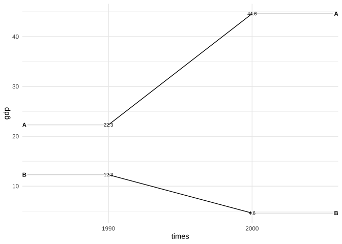

<!-- README.md is generated from README.Rmd. Please edit that file -->

# Graphs

<!-- badges: start -->
<!-- badges: end -->

This site is the home, a personal package, and a vehicle for graphs made
with R. It installs the source code of illustrations and other graphs
that I made and provides convenient functions to make graphs with
`ggplot2` (e.g. slope plots.)

## Installation

You can install Graphs from [GitHub](https://github.com/) with:

``` r
# install.packages("devtools")
devtools::install_github("edgar-treischl/Graphs")
```

## Example

Without input, the `plotgraph()` function returns all available graphs.

``` r
library(Graphs)
plotgraph()
#> Error in plotgraph(): Please run `plotgraph()` with a valid argument.
#> Valid examples are:
#> anscombe_quartet.R
#> boxplot_illustration.R
#> boxplot_pitfalls.R
#> data_joins.R
#> datasaurus.R
#> gapminder.R
#> pacman.R
#> simpson.R
#> ucb_admission.R
```

The `plotgraph()` function just picks the installed source code and
returns the graphs. For example, the `datasaurus` plot.

``` r
## basic example code
plotgraph("datasaurus.R")
```


And the package gives access to convenient functions to make `ggplot2`
graphs with less effort. For example, `ggslope()` returns a slope chart.

``` r
library(tidyr)
#> Warning: Paket 'tidyr' wurde unter R Version 4.1.2 erstellt
library(ggplot2)
#> Warning: Paket 'ggplot2' wurde unter R Version 4.1.2 erstellt
df <- tribble(
 ~times, ~country,  ~gdp, ~inc,
 "1990",   "A",  22.3, TRUE,
 "2000",   "A",  44.6, TRUE,
 "1990",   "B",  12.3, FALSE,
 "2000",   "B",  4.6, FALSE
 )

ggslope(df,
         times = times,
         outcome = gdp,
         group = country)+
  theme_minimal()
```


